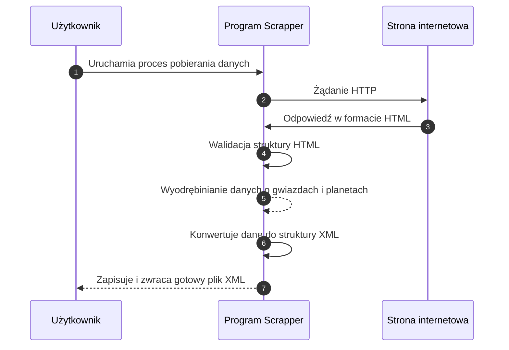

## Opis projektu

*Scrapper* to narzędzie służące do automatycznego pozyskiwania i przetwarzania danych astronomicznych z wybranych stron internetowych.

Głównym zadaniem programu jest analiza zawartości serwisu oraz wydobycie szczegółowych informacji o gwiazdach, układach planetarnych i egzoplanetach.
Dane te są następnie strukturyzowane i zapisywane w formacie XML, co umożliwia ich dalsze wykorzystanie.

Efektem działania aplikacji jest plik XML zawierający kompletne informacje o układach gwiezdnych.



## Uruchomienie
```sh
python3 -m commands.main
```

## Dokumentacja pliku XML

Generowany plik XML zawiera dane dotyczące układów gwiezdnych, ich gwiazd oraz planet.
Struktura jest hierarchiczna:

```
StarSystems
 └── StarSystem
       ├── Location
       ├── Star
       │     └── Planet
```

Każdy poziom zawiera zestaw atrybutów opisujących właściwości obiektów astronomicznych.

***UWAGA!***\
Nie wszystkie atrybuty są obecnie dostępne lub dokładnie zbadane.
Podczas korzystania z pliku XML należy uwzględnić możliwość brakujących danych.
Pola opcjonalne zostały oznaczone w poniższych tabelach.

### Struktura szczegółowa

**StarSystems**\
&emsp; Element główny (root).Zawiera wszystkie układy gwiezdne.

&emsp;Atrybuty:\
&emsp;Brak.

**StarSystem**\
&emsp;Reprezentuje pojedynczy układ gwiezdny.

&emsp;Atrybuty:
| Nazwa | Typ  | Opis |
| :-----|:----:| :----|
| Name | str | Nazwa systemu gwiezdnego |

**Location**\
&emsp;Opisuje pozycję systemu na niebie oraz jego odległość od Słońca.

&emsp;Atrybuty:
| Nazwa | Typ  | Opis |
| :-----|:----:| :----|
| RightAscension | str | Rektascensja w formacie astronomicznym (HMS). |
| RightAscensionNum | float | Rektascensja w formie liczbowej (0° - 360°). |
| Declination | str | Deklinacja w formacie astronomicznym (DMS). |
| DeclinationNum | float | Deklinacja w formie liczbowej (-90° - 90°). |
| Parallax | float | Paralaksa określająca odległość gwiazdy (milisekundy łuku (mas)). |
| SunDistance | float | Odległość od Słońca w latach świetlnych (ly). |
| Constelation | str | Nazwa gwiazdozbioru, w którym znajduje się system. |

**Star**\
&emsp;Opisuje pojedynczą gwiazdę w systemie. Zawiera przynajmniej jeden element.

&emsp;Atrybuty:
| Nazwa | Typ  | Opis |
| :-----|:----:| :----|
| Name | str | Nazwa gwiazdy. |
| StarType | str | Ogólny typ gwiazdy. |
| StarSubType | str | *(opcionalne)* Dodatkowy podtyp gwiazdy. |
| SpectralClass | str | *(opcionalne)* Klasa widmowa gwiazdy. |
| MainDistance | float | *(opcionalne)* Odległość od głównej gwiazdy w systemie (jednostki astronomiczne AU). |
| Mass | float | *(opcionalne)* Masa gwiazdy w procentach masy Słońca (% M☉). |
| Size | float | *(opcionalne)* Promień gwiazdy w procentach promienia Słońca (% R☉). |
| Temperature | float | *(opcionalne)* Temperatura powierzchniowa w kelwinach (K). |
| Age | float | *(opcionalne)* Wiek gwiazdy w miliardach lat (Gyr). |
| Luminosity | float | *(opcionalne)* Jasność gwiazdy w jednostkach słonecznych (L☉). |
| ApperentMagnitude | float | *(opcionalne)* Jasność widoma (magnitude obserwowana z Ziemi). |
| AbsoluteMagnitude | float | *(opcionalne)* Jasność absolutna (magnitude przy 10 parsekach). |
| PhotometryK | float | *(opcionalne)* Widmo podczerwone typ K (~2190 nm) |
| PhotometryH | float | *(opcionalne)* Widmo podczerwone typ H (~1630 nm) |
| PhotometryJ | float | *(opcionalne)* Widmo podczerwone typ J (~1220 nm) |
| PhotometryGrp | float | *(opcionalne)* Widmo czerwone, Gaia Red Photometer (~630–1050 nm) |
| PhotometryI | float | *(opcionalne)* Widmo bliskiej podczerwieni typ I (~806 nm) |
| PhotometryG | float | *(opcionalne)* Widmo szerokie, Gaia G-band (~673 nm) |
| PhotometryV | float | *(opcionalne)* Widmo zielono-żółte, widzialne (~550 nm) |
| PhotometryGbp | float | *(opcionalne)* Widmo niebieskie, Gaia Blue Photometer (~330–680 nm) |
| PhotometryV | float | *(opcionalne)* Widmo niebieskie (~440 nm) |
| PhotometryV | float | *(opcionalne)* Widmo ultrafiolet (~365 nm) |

**Planet**
Opisuje pojedynczą planetę krążącą wokół gwiazdy. Obiekt *Star* może niezawierać tych elementów.

&emsp;Atrybuty:
| Nazwa | Typ  | Opis |
| :-----|:----:| :----|
| Name | str | Nazwa planety. |
| PlanetType | str | Typ planety. |
| PlanetSubtype | str | *(opcionalne)* Podtyp planety. |
| DistanseFromStar | float | *(opcionalne)* Średnia odległość od gwiazdy (jednostki astronomiczne AU). |
| OrbitAroundStar | float | *(opcionalne)* Okres orbitalny (lata). |
| Eccentricity | float | *(opcionalne)* Mimośród orbity. |
| Mass | float | *(opcionalne)* Masa planety w jednostkach masy Ziemi (M⊕). |
| Size | float | *(opcionalne)* Promień planety w jednostkach promienia Ziemi (R⊕). |
| Density | float | *(opcionalne)* Gęstość planety w kg/m³. |
| Temperature | float | *(opcionalne)* Temperatura planety (K). |
| YearDiscover | int | *(opcionalne)* Rok odkrycia planety. |
| HabitabilityZoneMin | float | *(opcionalne)* Dolna granica ekosfery (jednostki astronomiczne AU). |
| HabitabilityZoneMax | float | *(opcionalne)* Górna granica ekosfery (jednostki astronomiczne AU). |
